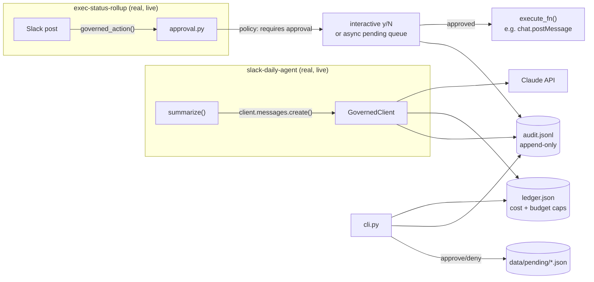

# Agent Control Tower

<div align="center">

[](https://www.python.org/)
[](https://www.anthropic.com/)
[](tests/)
[]()

</div>

A lightweight, auditable governance layer for AI agents — cost tracking with
hard budget caps, an append-only audit log, and a human-approval gate for
write-side-effect actions (Slack posts, Jira writes, email sends). Not a
toy: it's retrofitted onto two real, already-running agents in this
portfolio — [slack-daily-agent](https://github.com/PlainJane20/slack-daily-brief)
and [exec-status-rollup](https://github.com/PlainJane20/exec-status-rollup) —
and proven against them live, not just unit-tested in isolation.

**Why this exists:** every other project in this series adds a new agent.
This one governs the agents that already exist. Named for the aviation
metaphor that also runs through [tarmac](https://github.com/PlainJane20/tarmac) —
if Tarmac governs program delivery, this is the control tower for the AI
agents doing the work.

## The design problem this had to solve

`slack-daily-agent` runs unattended every morning via `launchd` — its README
documents that unattended path being *verified*, not assumed, by running it
with stdin bound to `/dev/null`. A governance layer that blocks on an
approval prompt would silently break that guarantee the moment it was
wired in. So the policy is scoped per action type, not global — see
[`policy.py`](policy.py):

| Action type | Policy | Why |
|---|---|---|
| `llm_call` | Never gated | Read-only against Claude — cost tracking is the relevant control, not approval |
| `slack_post_recurring` | Auto-approved | The same low-risk scheduled action every day, already reviewed once |
| `slack_post_adhoc` | Requires approval | A one-off external post is a different risk profile than a daily recurring one |
| `jira_write`, `email_send` | Requires approval | Always — these mutate external systems |

## Architecture



## Key engineering decisions

| Decision | Why |
|---|---|
| Policy is a declarative dict, not if/else in application code | `policy.py` is the one file a governance reviewer needs to read — the enforcement logic in `approval.py` never encodes a risk judgment itself, it just looks the action type up |
| Approval mode is explicit (`interactive=True/False`), never inferred | A caller has to decide whether it can block on stdin. Guessing from "is this a TTY?" is exactly the kind of implicit behavior that broke the unattended-cron guarantee once already in this series |
| Async approval doesn't try to resume execution | There's no real way to resume a Python function that already returned across a process boundary without seriously over-engineering it. `resolve()` marks a request cleared; the calling agent re-attempts on its next run — the same pattern a GitHub Actions required-reviewer approval uses (a new job run, not a resumed one) |
| `GovernedClient` mirrors `anthropic.Anthropic()`'s exact call shape | `client.messages.create(...)` works identically whether `client` is real or governed — retrofitting an existing agent is a one-line change to client construction, not a rewrite of its logic |
| Deterministic logic (ledger math, audit I/O, approval state machine) gets unit tests, not an eval harness | Consistent with the same split used in `exec-status-rollup` — there's no model in the loop in any of these three modules, so there's nothing for an LLM judge to grade |

## Proof it actually works — live retrofit evidence

Not a demo script — this is the real `data/ledger.json` and `data/audit.jsonl`
committed to this repo, produced by running the actual other two agents in
this series against real Slack and real Jira:

- **`slack-daily-agent`**: a real scheduled brief run flowed cost (`$0.0613`,
  1723 input / 3740 output tokens) and an audit record into this repo's
  ledger — with the unattended `launchd` path re-verified afterward
  (`< /dev/null`, exit 0, no hang) to confirm the retrofit didn't
  reintroduce the exact failure mode the policy was designed to prevent.
- **`exec-status-rollup`**: tested both branches of the approval gate live —
  denied a Slack post (blocked, nothing sent, audit shows
  `write_action_denied`) and then approved the same action on a second run
  (posted for real, audit shows `write_action_approved` →
  `write_action_executed`).

## Setup

```bash
python3 -m venv venv
source venv/bin/activate
pip install -r requirements.txt
python -m pytest tests/ -v
```

## Usage

```bash
# Inspect spend
python cli.py ledger --agent slack-daily-agent

# Inspect the audit trail
python cli.py audit --agent exec-status-rollup --kind write_action_approved

# See what's waiting on a human
python cli.py pending
python cli.py approve <request-id>
python cli.py deny <request-id>
```

### Retrofitting a new agent

```python
import sys
sys.path.insert(0, "../agent-control-tower")
from governed_client import GovernedClient

client = GovernedClient("my-agent", api_key=..., daily_budget=5.00)
# client.messages.create(...) works exactly like anthropic.Anthropic() from here
```

```python
from approval import governed_action, ApprovalDenied

try:
    governed_action("my-agent", "jira_write", "close ticket X",
                     execute_fn=lambda: jira_client.close(ticket_id),
                     interactive=True)
except ApprovalDenied:
    ...
```

## Contact

<div align="center">

### **Navi Sohi**
*Technical Program Manager & Automation Engineer*

<br>

[](https://www.linkedin.com/in/navisohi/)
[](https://github.com/PlainJane20)
[](https://mail.google.com/mail/?view=cm&fs=1&to=nks.ai.dev@gmail.com)

<br>

</div>
