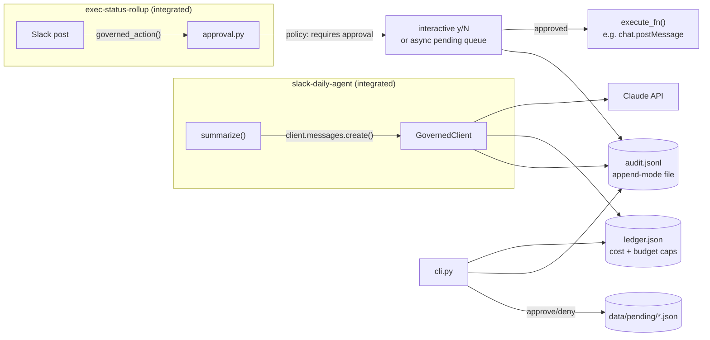

# Agent Control Tower

### *Policy, budget, approval, and audit controls for autonomous agents*

<div align="center">

[](https://www.python.org/)
[](https://www.anthropic.com/)
[](tests/)
[-2a78d6?style=for-the-badge)]()

</div>

A lightweight, auditable governance layer for AI agents — cost tracking with
budget caps (checked before each call, so a single call can overshoot), an append-only-by-convention audit log (plain file, not tamper-evident), and a human-approval gate for
write-side-effect actions (Slack posts, Jira writes, email sends). It is a
small prototype. Integration code exists in two other agents in this
portfolio — [slack-daily-agent](https://github.com/PlainJane20/slack-daily-brief)
and [exec-status-rollup](https://github.com/PlainJane20/exec-status-rollup) —
and the committed ledger/audit data shows a few runs through it. See
[Known limitations](#known-limitations) before relying on any of it.

**Why this exists:** every other project in this series adds a new agent.
This one governs the agents that already exist. Named for the aviation
metaphor that also runs through [tarmac](https://github.com/PlainJane20/tarmac) —
if Tarmac governs program delivery, this is the control tower for the AI
agents doing the work.

> **The competency this is really practicing:** retrofitting governance
> onto agents that already exist, not designing a governance layer on a
> blank whiteboard — integrated with
> [slack-daily-brief](https://github.com/PlainJane20/slack-daily-brief)
> and [exec-status-rollup](https://github.com/PlainJane20/exec-status-rollup)
> (the "two agents" claim is based on those repos' imports, not independently verified end to end). For scale
> context: ServiceNow's 2026 "AI Control Tower" initiative and Copado's
> "AgentOps" cover this same governance-for-agents idea at enterprise
> scale — same idea, three very different weight classes.

> **Related work in this portfolio:** [slack-daily-brief](https://github.com/PlainJane20/slack-daily-brief)
> and [exec-status-rollup](https://github.com/PlainJane20/exec-status-rollup) aren't
> just cited here — their local checkouts import this repo (optionally; if it is
> not found they run ungoverned): slack-daily-brief's `agent.py`
> imports `GovernedClient` to wrap its Claude calls under a cost ledger,
> and exec-status-rollup's `run_rollup.py` imports `governed_action` to gate
> its Slack post behind human approval. Both of their READMEs point back
> here the same way, so the link is documented from both directions.

## At a glance

| | |
|---|---|
| **Problem** | Useful agents can still create unmanaged cost, opaque decisions, or unauthorized external side effects |
| **Approach** | Declarative action policy, explicit approval modes, budget caps, and audit records |
| **Proof** | 22 unit tests; a handful of committed audit records from the two integrated agents |
| **Safety posture** | Read-only model calls remain non-blocking; write actions are risk-tiered and auditable |

## Competencies demonstrated

| Competency | Observable evidence |
|---|---|
| AI governance | Separates model inference, policy evaluation, approval, and execution |
| Systems integration | Retrofitted through compatibility wrappers instead of application rewrites |
| Operational resilience | Preserves unattended scheduled execution while gating higher-risk actions |
| Financial stewardship | Per-agent ledgers and daily budget caps (pre-call check) track cost |
| Auditability | Audit event records (plain file, not tamper-evident) and explicit approval state transitions |

## The design problem this had to solve

`slack-daily-agent` runs unattended every morning via `launchd` — its README
documents that unattended path being *verified*, not assumed, by running it
with stdin bound to `/dev/null`. A governance layer that blocks on an
approval prompt would silently break that guarantee the moment it was
wired in. So the policy is scoped per action type, not global — see
[`policy.py`](policy.py):

| Action type | Policy | Why |
|---|---|---|
| `llm_call` | Never gated | Read-only against Claude — cost tracking is the relevant control, not approval |
| `slack_post_recurring` | Auto-approved | The same low-risk scheduled action every day, already reviewed once |
| `slack_post_adhoc` | Requires approval | A one-off external post is a different risk profile than a daily recurring one |
| `jira_write`, `email_send` | Requires approval | Always — these mutate external systems |

## Architecture


```mermaid
flowchart LR
    subgraph "slack-daily-agent (integrated)"
        SA["summarize()"] -->|"client.messages.create()"| GC1["GovernedClient"]
    end
    subgraph "exec-status-rollup (integrated)"
        ER["Slack post"] -->|"governed_action()"| GA["approval.py"]
    end

    GC1 --> Claude["Claude API"]
    GC1 --> Ledger[("ledger.json<br/>cost + budget caps")]
    GC1 --> Audit[("audit.jsonl<br/>append-mode file")]

    GA -->|policy: requires approval| Prompt["interactive y/N<br/>or async pending queue"]
    Prompt -->|approved| Execute["execute_fn()<br/>e.g. chat.postMessage"]
    Prompt --> Audit

    CLI["cli.py"] --> Ledger
    CLI --> Audit
    CLI -->|approve/deny| Pending[("data/pending/*.json")]
```

## Key engineering decisions

| Decision | Why |
|---|---|
| Policy is a declarative dict, not if/else in application code | `policy.py` is the one file a governance reviewer needs to read — the enforcement logic in `approval.py` never encodes a risk judgment itself, it just looks the action type up |
| Approval mode is explicit (`interactive=True/False`), never inferred | A caller has to decide whether it can block on stdin. Guessing from "is this a TTY?" is exactly the kind of implicit behavior that broke the unattended-cron guarantee once already in this series |
| Async approval doesn't try to resume execution | `resolve()` only flips a request's status. The intent was for the calling agent to re-attempt on its next run, but that is **not implemented**: `governed_action()` never looks up an approved request and always queues a new one (see Known limitations) |
| `GovernedClient` mirrors `anthropic.Anthropic()`'s exact call shape | `client.messages.create(...)` works identically whether `client` is real or governed — retrofitting an existing agent is a one-line change to client construction, not a rewrite of its logic |
| Deterministic logic (ledger math, audit I/O, approval state machine) gets unit tests, not an eval harness | Consistent with the same split used in `exec-status-rollup` — there's no model in the loop in any of these three modules, so there's nothing for an LLM judge to grade |

## Evidence — committed run data

This is the `data/ledger.json` and `data/audit.jsonl`
committed to this repo, which the author says came from running the other two agents against Slack and Jira (not independently reproducible from this repo; the file holds only 5 events):

- **`slack-daily-agent`**: the ledger shows a brief run with cost (`$0.0613`,
  1723 input / 3740 output tokens) and an audit record. The README
  of that repo claims the unattended `launchd` path was re-checked; not verified here.
- **`exec-status-rollup`**: audit shows the synchronous (interactive) approval gate
  exercised on both branches: `write_action_denied`, then
  `write_action_approved` → `write_action_executed`. The async queue path has no such evidence and does not work end to end (see below).

## Known limitations

Verified by reading the code:

- **Audit log is not tamper-evident.** `audit.jsonl` is a plain file opened in append mode. There is no hash chain, signature, or write protection; anyone with file access can edit or delete lines undetected. "Append-only" describes what this code does, not a guarantee.
- **Async approval never executes the action.** `cli.py approve` only sets `status: approved` in `data/pending/<id>.json`. `governed_action()` never checks for prior approved requests; each non-interactive call creates a fresh pending request and raises `ApprovalPending`. An approved request is never consumed, so only the interactive (`interactive=True`) path actually runs gated actions.
- **Ledger is not concurrency-safe.** `record_usage()` reads, modifies, and rewrites the whole JSON file with no locking; simultaneous agents can lose updates, which also weakens budget caps.
- **Budget cap is a pre-call check.** A call is blocked only if spend is already at or above the cap; the call that crosses it still happens.
- **Retrofit claims are partly unverified.** The two agents import this repo optionally and fall back to running ungoverned if it is missing. The committed data holds 5 audit events; the "live" runs could not be reproduced here.
- No authentication on `cli.py approve` (anyone who can run it can approve), and approvals do not bind to the action's arguments.

## Setup

```bash
python3 -m venv venv
source venv/bin/activate
pip install -r requirements.txt
python -m pytest tests/ -v
```

## Usage

```bash
# Inspect spend
python cli.py ledger --agent slack-daily-agent

# Inspect the audit trail
python cli.py audit --agent exec-status-rollup --kind write_action_approved

# See what's waiting on a human
python cli.py pending
python cli.py approve <request-id>
python cli.py deny <request-id>
```

### Retrofitting a new agent

```python
import sys
sys.path.insert(0, "../agent-control-tower")
from governed_client import GovernedClient

client = GovernedClient("my-agent", api_key=..., daily_budget=5.00)
# client.messages.create(...) works exactly like anthropic.Anthropic() from here
```

```python
from approval import governed_action, ApprovalDenied

try:
    governed_action("my-agent", "jira_write", "close ticket X",
                     execute_fn=lambda: jira_client.close(ticket_id),
                     interactive=True)
except ApprovalDenied:
    ...
```

## Contact

<div align="center">

### **Navi Sohi**
*Technical Program Manager & Automation Engineer*

<br>

[](https://www.linkedin.com/in/navisohi/)
[](https://github.com/PlainJane20)
[](https://mail.google.com/mail/?view=cm&fs=1&to=nks.ai.dev@gmail.com)

<br>

</div>
