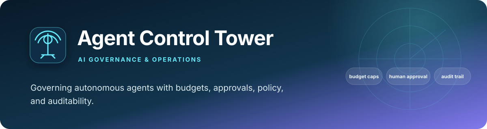
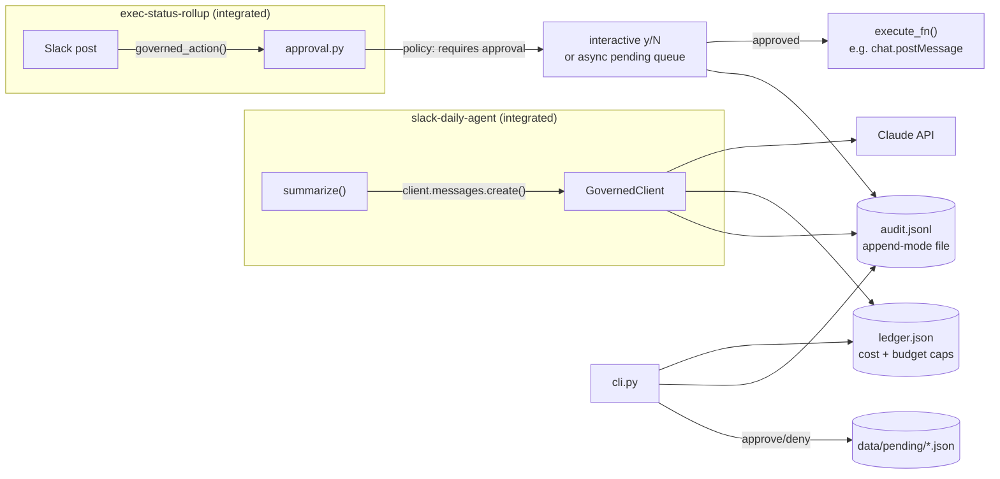

# Agent Control Tower

### *Policy, budget, approval, and audit controls for autonomous agents*

<div align="center">

[](https://www.python.org/)
[](https://www.anthropic.com/)
[](tests/)
[-2a78d6?style=for-the-badge)]()

</div>

A lightweight, auditable governance layer for AI agents — cost tracking with
budget caps (checked before each call, so a single call can overshoot), a hash-chained, tamper-evident (not tamper-proof) audit log with a `verify` command, and a human-approval gate (interactive, or async with single-use expiring approvals) for
write-side-effect actions (Slack posts, Jira writes, email sends). It is a
small prototype. Integration code exists in two other agents in this
portfolio — [slack-daily-agent](https://github.com/PlainJane20/slack-daily-brief)
and [exec-status-rollup](https://github.com/PlainJane20/exec-status-rollup) —
and the committed ledger/audit data shows a few runs through it. See
[Known limitations](#known-limitations) before relying on any of it.

**Why this exists:** every other project in this series adds a new agent.
This one governs the agents that already exist. Named for the aviation
metaphor that also runs through [tarmac](https://github.com/PlainJane20/tarmac) —
if Tarmac governs program delivery, this is the control tower for the AI
agents doing the work.

> **The competency this is really practicing:** retrofitting governance
> onto agents that already exist, not designing a governance layer on a
> blank whiteboard — integrated with
> [slack-daily-brief](https://github.com/PlainJane20/slack-daily-brief)
> and [exec-status-rollup](https://github.com/PlainJane20/exec-status-rollup)
> (the "two agents" claim is based on those repos' imports, not independently verified end to end). For scale
> context: ServiceNow's 2026 "AI Control Tower" initiative and Copado's
> "AgentOps" cover this same governance-for-agents idea at enterprise
> scale — same idea, three very different weight classes.

> **Related work in this portfolio:** [slack-daily-brief](https://github.com/PlainJane20/slack-daily-brief)
> and [exec-status-rollup](https://github.com/PlainJane20/exec-status-rollup) aren't
> just cited here — their local checkouts import this repo (optionally; if it is
> not found they run ungoverned): slack-daily-brief's `agent.py`
> imports `GovernedClient` to wrap its Claude calls under a cost ledger,
> and exec-status-rollup's `run_rollup.py` imports `governed_action` to gate
> its Slack post behind human approval. Both of their READMEs point back
> here the same way, so the link is documented from both directions.

## At a glance

| | |
|---|---|
| **Problem** | Useful agents can still create unmanaged cost, opaque decisions, or unauthorized external side effects |
| **Approach** | Declarative action policy, explicit approval modes, budget caps, and audit records |
| **Pattern** | Governance wrapper/gate around other agents (see [Architecture pattern](#architecture-pattern)) |
| **Proof** | 42 unit tests; a handful of committed audit records from the two integrated agents |
| **Safety posture** | Read-only model calls remain non-blocking; write actions are risk-tiered and auditable |

## Architecture pattern

**Governance wrapper/gate.** This repo contains no agent of its own and makes no model calls. It wraps other agents: `governed_client.GovernedClient` checks a budget (`ledger.py`) and logs each Claude call (`audit.py`), and `approval.governed_action` gates write actions using the declarative table in `policy.py`.

- **Deterministic vs model-driven:** Everything here is deterministic code. The model only runs inside the wrapped agents.
- **Human gate:** Yes, for actions the policy marks `approval`: an interactive y/N prompt, or an async queue approved with `cli.py approve`. Approvals are single-use and expire. `llm_call` and recurring Slack posts are never gated.
- **Honest limit:** The controls are opt-in: an agent is governed only if its code imports this repo (the integrations fall back to ungoverned if it is missing), and the approval is a local CLI command with no approver identity or authentication, so this is a prototype audit and approval layer, not an enforcement boundary.

## Competencies demonstrated

| Competency | Observable evidence |
|---|---|
| AI governance | Separates model inference, policy evaluation, approval, and execution |
| Systems integration | Retrofitted through compatibility wrappers instead of application rewrites |
| Operational resilience | Preserves unattended scheduled execution while gating higher-risk actions |
| Financial stewardship | Per-agent ledgers and daily budget caps (pre-call check) track cost |
| Auditability | Audit event records (hash-chained; `cli.py verify` checks it) and explicit approval state transitions |

## The design problem this had to solve

`slack-daily-agent` runs unattended every morning via `launchd` — its README
documents that unattended path being *verified*, not assumed, by running it
with stdin bound to `/dev/null`. A governance layer that blocks on an
approval prompt would silently break that guarantee the moment it was
wired in. So the policy is scoped per action type, not global — see
[`policy.py`](policy.py):

| Action type | Policy | Why |
|---|---|---|
| `llm_call` | Never gated | Read-only against Claude — cost tracking is the relevant control, not approval |
| `slack_post_recurring` | Auto-approved | The same low-risk scheduled action every day, already reviewed once |
| `slack_post_adhoc` | Requires approval | A one-off external post is a different risk profile than a daily recurring one |
| `jira_write`, `email_send` | Requires approval | Always — these mutate external systems |

## Architecture


```mermaid
flowchart LR
    subgraph "slack-daily-agent (integrated)"
        SA["summarize()"] -->|"client.messages.create()"| GC1["GovernedClient"]
    end
    subgraph "exec-status-rollup (integrated)"
        ER["Slack post"] -->|"governed_action()"| GA["approval.py"]
    end

    GC1 --> Claude["Claude API"]
    GC1 --> Ledger[("ledger.json<br/>cost + budget caps")]
    GC1 --> Audit[("audit.jsonl<br/>append-mode file")]

    GA -->|policy: requires approval| Prompt["interactive y/N<br/>or async pending queue"]
    Prompt -->|approved| Execute["execute_fn()<br/>e.g. chat.postMessage"]
    Prompt --> Audit

    CLI["cli.py"] --> Ledger
    CLI --> Audit
    CLI -->|approve/deny| Pending[("data/pending/*.json")]
```

## Key engineering decisions

| Decision | Why |
|---|---|
| Policy is a declarative dict, not if/else in application code | `policy.py` is the one file a governance reviewer needs to read — the enforcement logic in `approval.py` never encodes a risk judgment itself, it just looks the action type up |
| Approval mode is explicit (`interactive=True/False`), never inferred | A caller has to decide whether it can block on stdin. Guessing from "is this a TTY?" is exactly the kind of implicit behavior that broke the unattended-cron guarantee once already in this series |
| Async approval is consume-on-next-run, not resume | `resolve()` only flips a request's status. The next non-interactive `governed_action()` call for the same agent, action type and description consumes an approved request once (and queues a new one otherwise), so the caller re-attempts on its next scheduled run rather than being resumed |
| `GovernedClient` mirrors `anthropic.Anthropic()`'s exact call shape | `client.messages.create(...)` works identically whether `client` is real or governed — retrofitting an existing agent is a one-line change to client construction, not a rewrite of its logic |
| Deterministic logic (ledger math, audit I/O, approval state machine) gets unit tests, not an eval harness | Consistent with the same split used in `exec-status-rollup` — there's no model in the loop in any of these three modules, so there's nothing for an LLM judge to grade |

## Evidence — committed run data

This is the `data/ledger.json` and `data/audit.jsonl`
committed to this repo, which the author says came from running the other two agents against Slack and Jira (not independently reproducible from this repo; the file holds only 5 events):

- **`slack-daily-agent`**: the ledger shows a brief run with cost (`$0.0613`,
  1723 input / 3740 output tokens) and an audit record. The README
  of that repo claims the unattended `launchd` path was re-checked; not verified here.
- **`exec-status-rollup`**: audit shows the synchronous (interactive) approval gate
  exercised on both branches: `write_action_denied`, then
  `write_action_approved` → `write_action_executed`. The async queue path (approve, then consume on the next run) is covered by unit tests only; the committed data has no run of it.

## Known limitations

Verified by reading the code:

- **Audit log is tamper-evident, not tamper-proof.** New records are hash-chained (`prev_hash` + `hash`, sha256) and `python cli.py verify` detects edited, deleted, inserted or reordered records. Someone with write access can still recompute the whole chain or truncate the tail undetected (no signature or external anchor). Lines written before chaining (such as the 5 committed events) form an unprotected legacy prefix; the chain starts at the first new record.
- **Async approval is single-use and expires, but is unauthenticated.** A non-interactive `governed_action()` call runs a gated action only if it finds an approved, unconsumed, unexpired request matching agent, action type and a sha256 of the description; it marks it consumed before running (at-most-once: a failure inside the action does not auto-retry). Approvals expire after 24h by default (`approval_ttl_seconds` or `ACT_APPROVAL_TTL_SECONDS`). Approval is bound to the description string, not to the real call arguments behind it.
- **Locking is advisory and single-host.** The ledger, audit log and approval queue use `fcntl.flock`; this protects concurrent runs on one machine (tested with threads and processes) but is a no-op on platforms without `fcntl` and unreliable on network filesystems.
- **Budget cap is a pre-call check.** A call is blocked only if spend is already at or above the cap; the call that crosses it still happens.
- **Retrofit claims are partly unverified.** The two agents import this repo optionally and fall back to running ungoverned if it is missing. The committed data holds 5 audit events; the "live" runs could not be reproduced here.
- No authentication on `cli.py approve`: anyone who can run it can approve.

## Setup

```bash
python3 -m venv venv
source venv/bin/activate
pip install -r requirements.txt
python -m pytest tests/ -v
```

## Usage

```bash
# Inspect spend
python cli.py ledger --agent slack-daily-agent

# Inspect the audit trail
python cli.py audit --agent exec-status-rollup --kind write_action_approved

# Check the audit hash chain (exit code 1 if broken)
python cli.py verify

# See what's waiting on a human
python cli.py pending
python cli.py approve <request-id>
python cli.py deny <request-id>
```

### Retrofitting a new agent

```python
import sys
sys.path.insert(0, "../agent-control-tower")
from governed_client import GovernedClient

client = GovernedClient("my-agent", api_key=..., daily_budget=5.00)
# client.messages.create(...) works exactly like anthropic.Anthropic() from here
```

```python
from approval import governed_action, ApprovalDenied

try:
    governed_action("my-agent", "jira_write", "close ticket X",
                     execute_fn=lambda: jira_client.close(ticket_id),
                     interactive=True)
except ApprovalDenied:
    ...
```

## Contact

<div align="center">

### **Navi Sohi**
*Technical Program Manager & Automation Engineer*

<br>

[](https://www.linkedin.com/in/navisohi/)
[](https://github.com/PlainJane20)
[](https://mail.google.com/mail/?view=cm&fs=1&to=nks.ai.dev@gmail.com)

<br>

</div>
